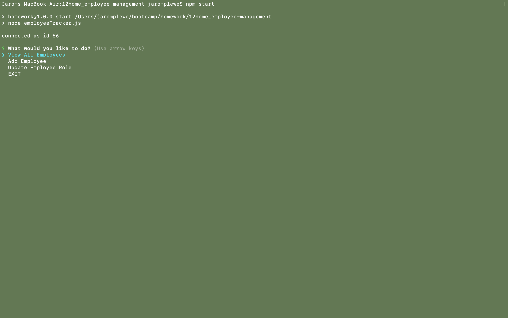
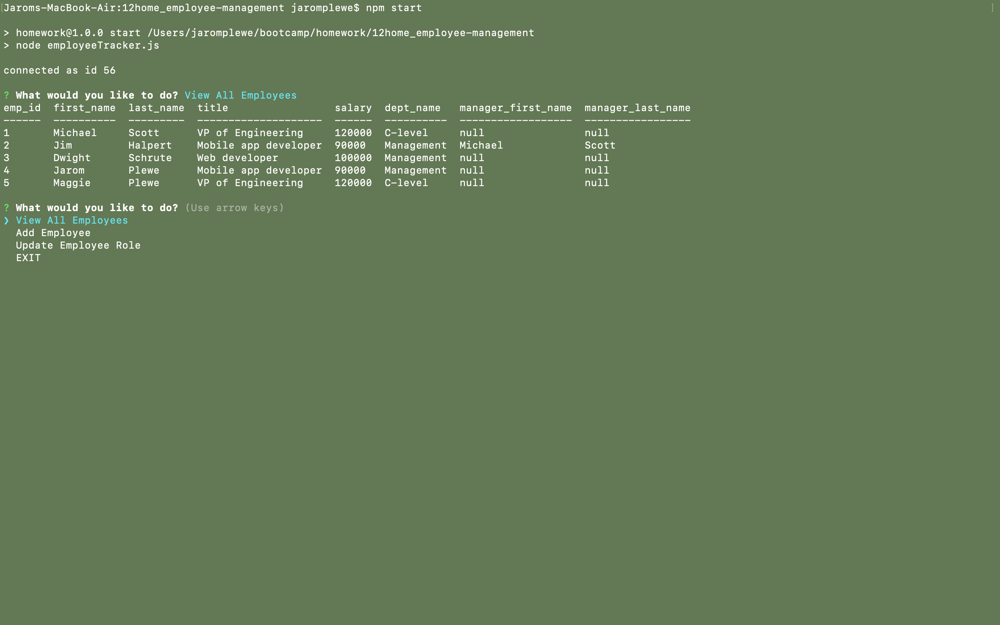
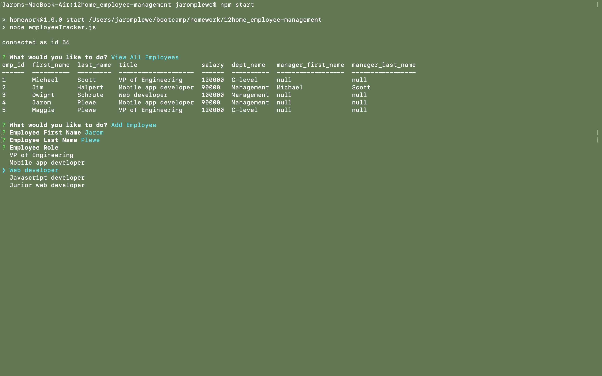

# Employee Tracker

### Technologies used
* Node.js
* Inquirer.js
* MySQL

### Installation and usage
* Clone this repository
* Load the schema and seeds files into your MySQL Workbench
* In terminal, run command npm start
* Follow Prompts!

### Screenshots

#### Main Screen

#### View Employees

#### Add Employee

#### Update Employee
